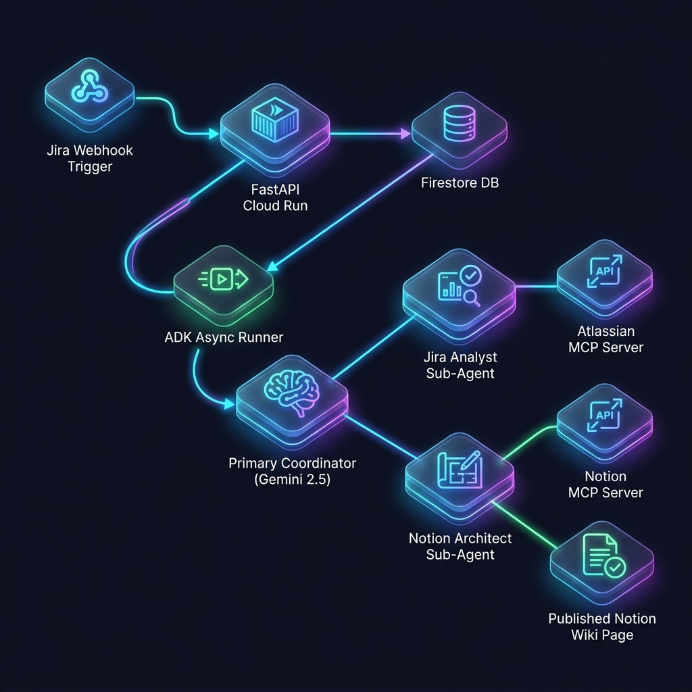

# Nexus Agent Coordinator

An autonomous multi-agent orchestration service built with Google Agent Development Kit (ADK) and FastAPI that acts as a central 'Nexus' to bridge webhooks and automate complex workflows across external platforms via Model Context Protocol (MCP).

## Overview

The Nexus Agent Coordinator automates complex, multi-system tasks by utilizing a multi-agent architectural pattern. Designed as an event-driven system, it intercepts external webhooks (e.g., from Jira), processes the payload using a primary Coordinator Agent powered by Gemini 2.5 Flash, and orchestrates specialized Sub-Agents (Jira Analyst, Notion Architect) that interact natively with remote MCP servers.

This architecture handles complex issue processing idempotently and asynchronously.

## Features

- **Google ADK Driven**: Agents are modularized (Jira Analyst, Notion Architect) offering high scalability. Future integrations act as new nodes.
- **Gemini 2.5 Flash**: Employs ultra-low latency semantic parsing to handle background webhook events concurrently without bottlenecks.
- **Horizontal Scalability via Google Cloud Run**: The underlying FastAPI serverless structure naturally auto-scales based on fluctuating webhook traffic.
- **Idempotency with Cloud Firestore**: A NoSQL state layer tracks processed webhooks ensuring guaranteed idempotency and preventing duplicate agent runs on the same events.
- **Model Context Protocol (MCP)**: Future-proof streamable HTTP logic, avoiding brittle point-to-point APIs and granting the agents native, structured communication with external integrations.

## Architecture



1. A Jira webhook is triggered on issue creation.
2. The FastAPI `POST /api/webhooks/jira` endpoint processes the request.
3. Firestore verifies idempotency to prevent duplicate executions.
4. A Google ADK async session spins up, leveraging Gemini 2.5 Flash as the Primary Coordinator.
5. The Coordinator delegates to the Jira Analyst sub-agent (via Atlassian MCP) to parse deepest context.
6. Handoff occurs to the Notion Architect sub-agent (via Notion MCP) to draft and publish the analyzed output block to a centralized wiki.

## Execution

### Local Environment Setup
Ensure your local Python environment is activated, then boot the server:

```bash
conda create -n nexus-agent python=3.12
conda activate nexus-agent
python -m pip install -r requirements.txt
uvicorn main:app --reload
```

### Endpoints
The Swagger UI is available at `http://127.0.0.1:8000/docs`

**1. Async Webhook Trigger (e.g. from Jira)**
Simulate a webhook trigger for background processing:
```bash
curl -X 'POST' \
  'http://127.0.0.1:8000/api/webhooks/jira' \
  -H 'accept: application/json' \
  -H 'Content-Type: application/json' \
  -d '{
  "issue_id": "10024",
  "issue_key": "PROJ-123",
  "webhookEvent": "jira:issue_created",
  "summary": "Database connection timeout in production",
  "description": "Users are reporting 502 Bad Gateway errors when trying to checkout."
}'
```

**2. Synchronous Agent Tasks**
Manually query the Primary Coordinator for immediate tasks:
```bash
curl -X 'POST' \
  'http://127.0.0.1:8000/api/agent/task' \
  -H 'accept: application/json' \
  -H 'Content-Type: application/json' \
  -d '{
  "prompt": "Using the Jira Analyst, read the ticket PROJ-123 to analyze its severity, then hand off the context to the Notion Architect to generate an incident report document."
}'
```
